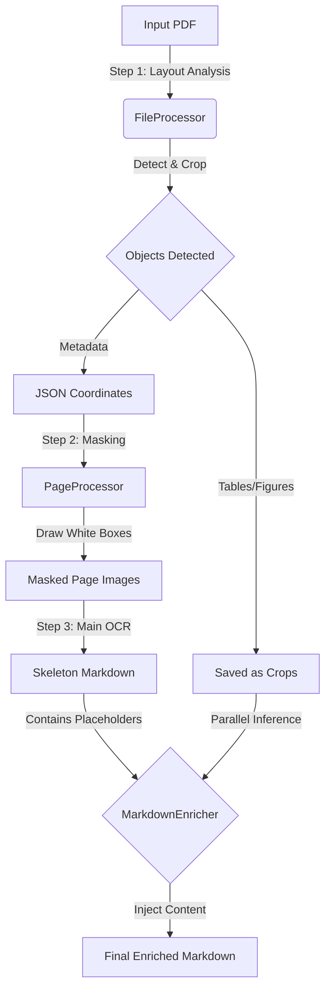

# 📄 CustomOCR Pipeline

[](https://python.org)
[](https://github.com/)

**A high-performance, layout-aware OCR system that converts complex PDFs into clean, structured Markdown.**

Unlike standard OCR tools that jumble text and tables, **CustomOCR** treats document elements intelligently. It detects tables and figures, masks them during the main text pass to prevent hallucinations, and then "enriches" the document by processing those specific elements with specialized high-resolution inference.

---

## 🚀 How It Works

The pipeline executes in three distinct phases to ensure maximum accuracy:



## ✨ Key Features

* **🔍 Intelligent Layout Analysis (DLA):** Uses computer vision to detect, locate, and crop tables, figures, and formulas before reading the text.
* **🎭 Content Masking:** Automatically "blanks out" non-text regions during the main OCR pass. This forces the model to ignore complex charts, preventing garbage output.
* **⚡ Parallelized Processing:** Built-in `ThreadPoolExecutor` dynamically scales to your CPU count ($N-1$ workers), allowing multiple pages and objects to be processed simultaneously.
* **🔄 Multi-Pass Enrichment:**
    1.  **Pass 1:** Generates a "Skeleton" document with placeholders (e.g., `PAGE 1 table_0: HERE`).
    2.  **Pass 2:** OCRs the specific high-res crops of tables/figures.
    3.  **Pass 3:** Stitches everything together into a cohesive Markdown file.
* **🛡️ Robust Error Handling:** Auto-corrects common OCR quirks (like escaped underscores `table\_0`) and handles missing files gracefully.

---

## ⚠️ System Dependencies

Before installing the Python packages, you **must** have the following system-level tools installed. These are required for PDF manipulation and conversion.

### 1. Poppler (Required for PDF → Image)
This is used by `pdf2image` to convert PDF pages into JPGs.

* **Ubuntu/Debian:**
  ```bash
  sudo apt-get install poppler-utils
  ```
* **MacOS (Homebrew):**
  ```bash
  brew install poppler
  ```
* **Windows:**
  Download the latest binary from [UB Mannheim](https://github.com/oschwartz10612/poppler-windows/releases/), extract it, and add the `bin` folder to your System PATH.

### 2. LibreOffice

* **Ubuntu/Debian:**
  ```bash
  sudo apt-get install libreoffice
  ```
* **MacOS:**
  ```bash
  brew install --cask libreoffice
  ```
* **Windows:**
  Download the installer from [libreoffice.org](https://www.libreoffice.org/download/download/).

---

## 🛠️ Installation

1.  **Clone the repository:**
    ```bash
    git clone [https://github.com/yourusername/CustomOCR_Pipeline.git](https://github.com/yourusername/CustomOCR_Pipeline.git)
    cd CustomOCR_Pipeline
    ```

2.  **Install Python dependencies:**
    ```bash
    pip install -r requirements.txt
    ```

3.  **Configure Environment:**
    Create a `.env` file in the root directory with your model API keys:
    ```env
    MODEL_API_KEY_LLAMA=your_key_here
    MODEL_URL_PATH_LLAMA=your_endpoint_url
    ```

---

## 🏃 Usage

Simply drop your PDF into the `inputs/` folder and run the app. The script automatically detects your CPU cores and optimizes the worker count.

```bash
python app.py
```

### Configuration
You can adjust the behavior in `app.py` or `config.py`:
* **Max Workers:** Defaults to `CPU_COUNT - 1` for optimal performance.
* **Models:** Switch between `Llama-4-Maverick`, `Qwen-3-VL`

---

## 📂 Project Structure

```text
CustomOCR_Pipeline/
├── inputs/                 # Drop PDFs here
├── output/                 # Generated results (Images, Markdown, JSON)
├── app.py                  # Main entry point (Orchestrator)
├── config.py               # System prompts and model keys
├── dla.py                  # Deep Layout Analysis (Object Detection)
├── FileProcessor.py        # Handles PDF->Image conversion & DLA
├── PageProcessor.py        # Manages Masking & Main OCR Loop
├── ContentMasker.py        # Draws white boxes over figures/tables
├── MarkdownEnricher.py     # Regex parsing & Injection logic
├── OCR.py                  # API Wrapper for VLM Inference
└── utils.py                # Helper functions
```

---


